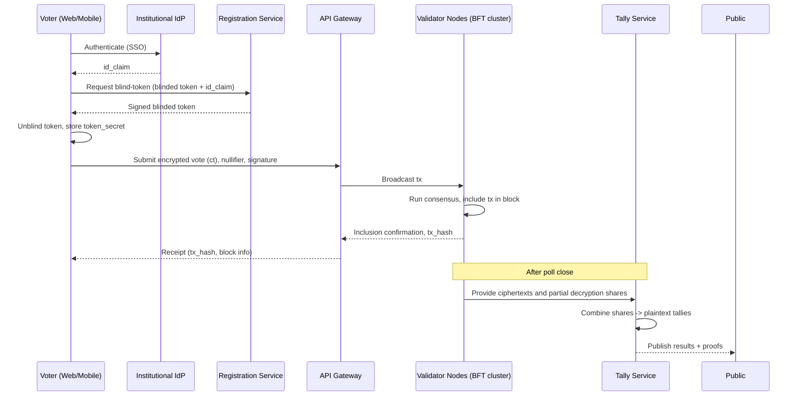

# Software Requirements Specification (SRS) - University Permissioned Blockchain Voting System

**Project:** University Permissioned Blockchain Voting System  
**Author:** (Team)  
**Date:** 2025-10-19

---

# 1. Introduction

## 1.1 Purpose
This document defines the software requirements for a secure, permissioned blockchain-based voting system for the university. The system will enable students, teachers, staff, and board members to register and vote remotely, guarantee one-person-one-vote, maintain voter confidentiality, produce real-time trustworthy results, and provide auditable integrity. The system must adopt Zero Trust principles and satisfy confidentiality, integrity, authenticity, and availability (CIAA).

## 1.2 Scope
The system covers:
- Voter registration and identity verification (institutional ID-based)
- Secure ballot creation, submission, and tallying
- Permissioned blockchain network for immutability, auditability and distributed validation
- Validator node network management (join/ban/quorum actions)
- Frontend web (Vue.js), mobile (Flutter), backend and blockchain node implementation (Node.js), and MySQL for supporting off-chain data
- Administrative portals for election managers, validators, and auditors
- Real-time vote counting and public result dashboard

## 1.3 Definitions, Acronyms, Abbreviations
- HSM — Hardware Security Module
- PKI — Public Key Infrastructure
- ZKP — Zero-Knowledge Proof
- PBFT — Practical Byzantine Fault Tolerance
- PoA — Proof of Authority
- AES — Advanced Encryption Standard
- TLS — Transport Layer Security
- JWT — JSON Web Token

# 2. Stakeholders and Users

- **Voters**: students, teachers, staff, board members (register, vote)
- **Election Administrators**: configure elections, approve candidates, manage schedules
- **Validator Node Operators**: host validator nodes, observe and validate blocks
- **Auditors**: verify logs, integrity, and compliance
- **Developers / DevOps**: implement and operate the system

# 3. High-Level System Overview

A permissioned blockchain (university validator nodes + optionally cloud-hosted nodes) will store signed vote transactions and block headers. To achieve high throughput and fast finality (target: ~3500 votes/sec) we will NOT use public Proof-of-Work mining. Instead we will use a Byzantine Fault Tolerant consensus algorithm (e.g., Tendermint / PBFT / HotStuff or a PoA with BFT finality) with batching and transaction parallelism. Each vote will be an encrypted ballot on-chain (or a reference to an encrypted ballot stored in a tamper-evident off-chain store), with cryptographic safeguards to ensure anonymity and single-vote property.

# 4. Assumptions and Constraints

- University provides authoritative identity records (student IDs, employee IDs) and an Identity Provider (IdP) or API for verification.
- Network connectivity is available for remote voting, but the system must defend against network loss and partitioning.
- Validator nodes are hosted by trusted university departments / designated partners.
- MySQL will be used for off-chain non-critical metadata only (user profiles, audit indices) — critical vote data must be protected cryptographically.
- Consent and legal/privacy regulations for holding voter data will be respected.

# 5. Goals and Security Objectives

- **Confidentiality:** Voter personal data and individual ballots must be protected. Ballots must not be linkable to a voter by anyone (including validators) after submission.
- **Integrity:** Votes cannot be altered or deleted once recorded. Tally results are provably derived from submitted ballots.
- **Authenticity:** Only authorised registered voters can cast exactly one ballot each.
- **Availability:** System must be available during election windows and resist DoS; must support 3500 votes/sec during peak.
- **Accountability/Auditability:** All actions are logged and auditable; malicious behavior by nodes is detectable.
- **Zero Trust:** All components treat each other as untrusted, require mutual authentication and authorization.

# 6. Functional Requirements

## 6.1 Identity & Registration
1. FR-REG-01: Voter registration uses institutional ID + multi-factor authentication (MFA). The university IdP (LDAP/SAML/OAuth2/OpenID Connect) will be the primary verification source.
2. FR-REG-02: During registration, system issues an ephemeral cryptographic voting credential — a keypair for the voter (client-side generated) and a certificate or signed token issued by a registration service.
3. FR-REG-03: Voter personal profile (name, institutional id, role) is stored encrypted in MySQL; only minimal mapping data (pseudonymous voter identifier) is stored on-chain.
4. FR-REG-04: The system must prevent registration duplicates by cross-checking institutional ID and requiring IdP validation. Duplicate-account alerts logged and flagged for admins.

## 6.2 Authentication and Authorization
1. FR-AUTH-01: Use Zero Trust authentication: mutual TLS (mTLS) between services, strong JWT tokens with short TTL for sessions, device attestation where possible.
2. FR-AUTH-02: MFA required for registration and for casting a vote (e.g., password + TOTP or push in university app).
3. FR-AUTH-03: Voter client must prove possession of a private key (digital signature) when casting a vote.

## 6.3 Ballot Creation & Secrecy
1. FR-BAL-01: Ballots must be encrypted client-side using an election public key (threshold-encryption) so that no single node can decrypt votes.
2. FR-BAL-02: Use threshold homomorphic encryption (e.g., threshold ElGamal / Paillier) or a mix-net + ZKP to enable tallying without revealing individual ballots. Decryption should require threshold of validator keys.
3. FR-BAL-03: The system must provide a non-linkable token or blind signature to allow a voter to prove eligibility without revealing identity to the tallying process.

## 6.4 Casting a Vote
1. FR-VOTE-01: Each vote submission must include: encrypted ballot, voter signature, registration proof token (blind-signed token or zero-knowledge proof), and a unique nullifier to prevent double-voting.
2. FR-VOTE-02: The backend checks eligibility and nullifier uniqueness (using a privacy-preserving approach — see 7.2) and if valid, broadcasts a signed transaction to validator nodes for inclusion in a block.
3. FR-VOTE-03: Once accepted by consensus, the vote transaction is considered recorded (immutable). A signed receipt (transaction hash + timestamp + validator signatures) is returned to voter.

## 6.5 Prevent Double Voting & Detect Bypass
1. FR-DUP-01: Use linkable anonymous credentials or nullifier scheme: the client generates a nullifier derived from their secret and the election id; nullifiers are published on-chain but do not reveal voter identity; duplicates are rejected.
2. FR-DUP-02: Backend and validators check nullifier uniqueness atomically before accepting a vote (consensus ensures global uniqueness).
3. FR-DUP-03: All failed or suspicious attempts are logged and include IP, device fingerprint, and timestamp; anomalies trigger alerts.

## 6.6 Tallying and Results
1. FR-TALLY-01: Tallying runs in real-time using encrypted ballots and homomorphic aggregation or threshold decryption once poll closes (or continuously with incremental proofs).
2. FR-TALLY-02: The system must show live aggregated results (counts) that are provably derived from committed transactions; provide cryptographic proofs for the public to verify the tally.
3. FR-TALLY-03: Provide audit endpoints allowing auditors to verify inclusion proofs for individual transaction hashes and the integrity of block headers.

## 6.7 Blockchain Network Management
1. FR-NODES-01: Validator nodes form a permissioned cluster. Node membership is controlled by a governance policy requiring a multi-admin quorum to add/remove nodes.
2. FR-NODES-02: Validators continuously validate block correctness and broadcast misbehavior evidence if detected.
3. FR-NODES-03: Misbehaving nodes can be slashed logically (removed from the permissioned set) by meeting a predetermined evidence-and-quorum protocol.
4. FR-NODES-04: Nodes maintain signed chain heads and use gossip/peer-to-peer sync; any fork is resolved by consensus finality rules.

## 6.8 Monitoring, Logging, Alerts
1. FR-MON-01: All node events, admin actions, and voter-facing actions are logged with tamper-evident append-only logs (signed and hashed onto the blockchain or into an audit chain).
2. FR-MON-02: Real-time monitoring dashboard for node health, vote throughput, suspect events, and alerts.

## 6.9 Admin & Audit Tools
1. FR-ADMIN-01: Admin GUI to create elections, configure candidates, set election window, and designate validators.
2. FR-AUDIT-01: Auditors can request and verify inclusion proofs, independent tally verification, and export logs for forensic analysis.

# 7. Design Decisions & Cryptographic Architecture

## 7.1 Permissioned Blockchain & Consensus
- Use a permissioned BFT consensus (Tendermint / HotStuff / PBFT or a PoA with BFT finality). These provide fast finality and high throughput compared to PoW.
- Configure validator set to N nodes; the consensus tolerates up to f faulty nodes where N >= 3f + 1.
- Use transaction batching and fast block times (e.g., 100--500ms block cadence with large batches) to reach high TPS. Also enable parallel validation and use efficient serialization.

## 7.2 Privacy-preserving Single Vote Enforcement
Options:
- **Linkable Anonymous Credentials / Nullifiers**: Each voter obtains a blind-signed eligibility token in registration. When voting, the voter reveals a nullifier (derived deterministically from token + election id) which is published on-chain. Duplicate nullifiers are rejected. Nullifier does not reveal identity but ensures single casting.
- **Threshold Encryption**: Ballots encrypted under election public key; validators perform threshold decryption only at tally-time with quorum, preventing any single node from seeing plaintext ballots.
- **Homomorphic Aggregation**: If votes are encoded numerically, homomorphic operations can aggregate ciphertexts so final decrypt yields totals without per-ballot decryption.

Recommendation: combine Blind-Signature token + Nullifier scheme for eligibility & single-vote enforcement and Threshold Homomorphic Encryption for tallying.

## 7.3 Receipt & Verifiability
- Issue cryptographic receipts to voters: signed transaction hash and Merkle inclusion proof.
- Public auditors can verify a vote was included (without linking to voter identity) by checking the inclusion proof and that the nullifier was unique.

## 7.4 Node Misbehavior and Governance
- Validators monitor and record evidence (signed conflicting proposals, equivocation proof). Evidence posted on-chain triggers governance voting among admins to remove node.
- Automated temporary quarantine (mark node as suspect) on detection; human-in-the-loop final removal.

# 8. Non-Functional Requirements (NFR)

## 8.1 Security
- NFR-SEC-01: All in-transit communication must use TLS 1.3 with mutual authentication for node-to-node channels.
- NFR-SEC-02: Private keys for validators stored in HSM or secure enclaves; no plaintext keys persisted in DB.
- NFR-SEC-03: Server-side services run with least privileges; containers scanned and images signed.
- NFR-SEC-04: Data-at-rest encryption (AES-256) for MySQL fields containing PII.

## 8.2 Performance & Scalability
- NFR-PERF-01: System must support peak throughput of 3500 votes/sec sustained for election windows. (Design: BFT consensus + batching + horizontal scaling + optimized serialization.)
- NFR-PERF-02: End-to-end vote submission latency (client -> inclusion in block) should be in the order of seconds (target < 2s under normal load) — actual depends on block cadence and batching.
- NFR-PERF-03: System must scale horizontally: stateless API tier, multiple validator nodes, caching (Redis) for ephemeral data.

## 8.3 Availability & Resilience
- NFR-AV-01: Achieve 99.95% availability during election windows via redundant services and geographically distributed validator nodes.
- NFR-AV-02: Node sync and snapshotting; support fast catch-up for new or recovering nodes.
- NFR-AV-03: Provide disaster recovery plans, backups of encrypted ballots and chain state, and periodic restore drills.

## 8.4 Privacy & Data Retention
- NFR-PRIV-01: Store minimal PII necessary; use pseudonymization and retention policy with secure deletion when required.
- NFR-PRIV-02: Cryptographic evidence and receipts retained for audit periods; raw PII retention in MySQL limited to policy.

## 8.5 Maintainability & Extensibility
- NFR-MAINT-01: Modular codebase (blockchain node, backend API, frontend, mobile), well-documented APIs and migration/upgrade paths for validator set changes.

# 9. System Architecture

## 9.1 Components
- **Client Apps**: Web (Vue.js) and Mobile (Flutter) — handle registration, key generation, ballot UI, and client-side encryption.
- **API Gateway & Auth Service** (Node.js) — handles IdP integration, MFA, issues short-lived tokens, proxies to backend services.
- **Registration Service** (Node.js + MySQL) — manages voter record, issues blind-signed tokens or certificates.
- **Blockchain Nodes / Validators** (Node.js runtime implementing a BFT engine) — receive signed vote transactions, validate, run consensus, append blocks.
- **Off-chain Store** (MySQL + object store) — holds encrypted voter metadata, encrypted ballots (optional), and audit indices.
- **Tally Service** (Node.js with crypto libs) — aggregates encrypted ballots and performs threshold decryption with validator participation.
- **Admin & Auditor UIs** — election management and forensic tools.
- **Monitoring & Logging Stack** — Prometheus/Grafana/ELK or equivalent.

## 9.2 Data Flows
1. Registration: Client -> Auth Service (IdP) -> Registration Service -> blind-signed token + pseudonym issued.
2. Voting: Client creates encrypted ballot, computes nullifier, requests blind-signature proof (if applicable), then submits the signed transaction to API Gateway -> validators.
3. Consensus: Validators validate signature, nullifier uniqueness, and broadcast blocks. Transaction included -> voter receives receipt.
4. Tallying: Tally service aggregates encrypted ballots and performs threshold decryption at close, publishes results + proofs.

# 10. Data Model (Summary)

Note: Critical vote content stored encrypted. MySQL used for non-sensitive metadata and indices.

## Tables (examples)
- `voters` (id, pseudonym_id, institution_id_hash, role, registration_status, public_key_fingerprint, created_at, encrypted_profile_blob)
- `blind_tokens` (token_id_hash, pseudonym_id, issued_at, revoked)
- `elections` (election_id, title, starts_at, ends_at, status, public_key_info)
- `candidates` (candidate_id, election_id, name, metadata)
- `votes_meta` (tx_hash, election_id, nullifier_hash, cipher_ref, inclusion_block, timestamp)
- `nodes` (node_id, pubkey, endpoint, status, last_seen)

# 11. API Contracts (representative)

## POST /api/v1/register
Request: {institution_id, id_proof, client_public_key, mfa_proof}  
Response: {pseudonym_id, blind_token}

## POST /api/v1/vote
Request: {election_id, encrypted_ballot_blob, nullifier_hash, blind_token_proof, signature}  
Response: {tx_hash, inclusion_proof: pending | merkle_proof}

## GET /api/v1/election/:id/results
Response: {live_count, proof_blob}

## GET /api/v1/tx/:hash
Response: {tx_status, inclusion_proof}

# 12. Consensus & Node Governance Protocol (summary)

- **Join Node:** Admin requests -> provide node public key and attestation -> governance quorum approves -> node added to validator set and receives config.
- **Evidence Posting:** Validators post signed evidence of equivocation to chain -> governance triggers voting to quarantine or remove.
- **Remove Node:** Requires quorum (e.g., >2/3) of remaining validators/admins to mark node as removed.

# 13. Threat Model & Mitigations

## 13.1 Threats
- Unauthorized voter impersonation
- Double-voting via token replay
- Node compromise and trying to alter history
- Denial-of-Service (DDoS) against API or nodes
- Insider threats or collusion among validators

## 13.2 Mitigations
- Use IdP verification + MFA, device attestation, client-side key generation to prevent impersonation.
- Nullifier + blind-signature scheme prevents replay and double-voting while preserving anonymity.
- Permissioned BFT consensus and signed chain heads + cross-checking prevent undetected history rewriting.
- rate-limiting, WAF, and DDoS mitigation at API edge; isolated validator endpoints behind ACLs.
- Threshold cryptography ensures no single validator can decrypt ballots.
- On compromise detection, quorum-based removal and forensics using signed logs.

# 14. Privacy & Legal Considerations

- Conduct privacy impact assessment (PIA) and comply with institutional policies.
- Store minimal PII; ensure GDPR-like rights if applicable (e.g., access, deletion where feasible and lawful).
- Provide transparent notice to voters about what data is collected and retained.

# 15. Testing & Verification

- Unit tests for cryptographic primitives, nullifier logic, and backend services.
- Integration tests simulating N nodes with f Byzantine nodes to test consensus safety.
- Load testing to validate 3500 votes/sec throughput with realistic payloads and network conditions.
- Security testing: threat modeling, static/dynamic code analysis, penetration testing, key escrow audits.
- End-to-end ballot privacy tests and proof verifications.

# 16. Deployment & Operations

- Containerized services (Docker) orchestrated by Kubernetes.
- Validator nodes deployed on university-managed or partner-hosted physical/VM instances with HSMs.
- CI/CD with signed releases; automated canary deployments and rollback procedures.
- Regular backups of encrypted data and chain snapshots stored in multiple regions.

# 17. Maintenance & Support

- Routine key rotation, vulnerability patching, and node health checks.
- Incident response plan with clear escalation paths and forensics playbook.
- Documentation for on-boarding new validator operators and admins.

# 18. Acceptance Criteria

- Successful registration, voting, and inclusion proof flow end-to-end for randomized testers.
- System sustains 3500 votes/sec in a controlled load test while preserving correctness.
- Proofs of tally correctness verifiable by an independent auditor.
- Ability to detect and remove a deliberately misbehaving node in a simulated scenario.
- No leakage of linkage between voter identity and ballot in privacy tests.

# 19. Appendix: Recommended Libraries / Components

- Cryptography: libsodium, node-forge, or native OpenSSL bindings; threshold crypto libraries (e.g., `shamir` for secret shares, `elliptic` libs, or specialized threshold Paillier implementations).
- Consensus: Tendermint, Hyperledger Fabric (for permissioned networks), or custom Node.js implementation using a known BFT framework.
- Messaging/Queue: Kafka or RabbitMQ for backend orchestration.
- Monitoring: Prometheus + Grafana + ELK stack.
- HSMs: AWS CloudHSM / Azure Key Vault HSM or on-premise HSMs (YubiHSM / Thales)

# 20. Open Design Decisions / Next Steps

1. Choose exact consensus engine (Tendermint / HotStuff / Fabric) based on validator count, trust model and implementation effort.
2. Decide on cryptographic approach for ballots (homomorphic vs mixnet + ZKP). Recommendation: threshold homomorphic encryption combined with blind-signature based eligibility tokens.
3. Produce detailed sequence diagrams and crypto protocol specifications (nullifier derivation, blind-signature flow, threshold key generation and rotation).
4. Prototype a minimal voting flow (client key generation, registration blind-token issuance, vote submission, inclusion proof) and perform privacy tests.

---

# Sprint-level User Stories & Acceptance Criteria

Each story includes the goal, acceptance criteria (pass/fail), and example implementation tasks.

## Sprint 0 — Foundations (infra + repo + infra-as-code)
**US-0001 — Project skeleton & CI/CD**
- AC:
  - Repositories exist for backend, blockchain-node, frontend, mobile, infra.
  - CI/CD pipeline runs tests on PRs and builds containers.
  - Deployable dev cluster (K8s or Docker Compose) is available.
- Tasks: repo scaffolding, CI config, basic Dockerfiles, test K8s manifests.

**US-0002 — PKI & secrets management**
- AC:
  - Key management process documented.
  - A secrets store (Vault/KeyVault) configured; at least one validator key in HSM or simulated secure store.
- Tasks: integrate HashiCorp Vault or equivalent, scripts to create certs.

## Sprint 1 — Identity & Registration (IdP integration + blind token issuance)
**US-101 — Institutional IdP login**
- As a voter, I want to register/login with my institutional ID via the university IdP so I can prove eligibility.
- AC:
  - OAuth2/OpenID Connect / SAML SSO flows implemented against IdP in dev.
  - Successful login returns a verified university id_claim.
- Tasks: implement IdP adapter, map verified attributes.

**US-102 — Client-side key generation + pseudonym creation**
- As a voter, a keypair (Ed25519/ECDSA) is generated on my device and stored securely.
- AC:
  - Client generates keypair and displays/exports public key fingerprint.
  - Private key never sent to server.
- Tasks: implement client keygen in Vue and Flutter.

**US-103 — Blind-signed eligibility token issuance**
- After IdP verification, registration service issues a blind-signed eligibility token (Chaumian blind signature) bound to election(s).
- AC:
  - Client receives blind-signed token without the server learning the token contents.
  - Server stores only a record that the voter was issued a token (no linkable token content).
- Tasks: implement blind-signature server endpoint and client flow.

## Sprint 2 — Vote UI + Local encryption + Nullifier generation
**US-201 — Ballot UI & selection**
- AC:
  - Voter can see ballots for active elections and select options.
  - Validate candidate list from backend.
- Tasks: ballot UI components.

**US-202 — Client-side encryption & nullifier**
- AC:
  - Client encrypts ballot with election public params.
  - Client produces a nullifier (deterministic, non-revealing) and includes blind-token proof.
  - On submit, client signs the transaction with private key.
- Tasks: implement client encryption, nullifier algorithm, compose transaction payload.

## Sprint 3 — Backend validation & blockchain tx
**US-301 — Verify eligibility + nullifier uniqueness**
- AC:
  - Backend validates blind-token proof and checks nullifier uniqueness in a privacy-preserving way.
  - If nullifier already exists, vote rejected and logged.
- Tasks: implement token verification, nullifier DB/indexing (store only hashed nullifiers).

**US-302 — Submit transaction to validator nodes**
- AC:
  - Backend broadcasts signed vote transaction to validator nodes; receives tx hash.
  - Voter receives a signed receipt containing tx hash and timestamp.
- Tasks: implement tx broadcasting, receipt format.

## Sprint 4 — Permissioned BFT node + block inclusion
**US-401 — Validator node basic**
- AC:
  - First 3 validator nodes run and come to consensus on simple transactions.
  - Inclusion of vote transaction appears in block and block header is signed.
- Tasks: configure Tendermint/Hyperledger Fabric/TBD, implement node integration with Node.js runtime.

**US-402 — Inclusion proof endpoint**
- AC:
  - API endpoint returns Merkle inclusion proof for a tx hash once included.
- Tasks: build proof generation and API.

## Sprint 5 — Threshold keygen & tallying
**US-501 — Key generation ceremony**
- AC:
  - Validators run a threshold key generation (T-KG) protocol producing distributed shares; no single node holds full private key.
  - Public election key published.
- Tasks: integrate threshold crypto library, run ceremony simulation.

**US-502 — Homomorphic aggregation or ciphertext store**
- AC:
  - System can aggregate encrypted ballots (homomorphic) or store ciphertexts ready for threshold decryption post close.
- Tasks: implement aggregator service.

## Sprint 6 — Live results + auditing
**US-601 — Live result display with proofs**
- AC:
  - Live aggregated counts are displayed.
  - Each displayed count is accompanied by a proof (range proofs or homomorphic sum verification) auditors can verify.
- Tasks: frontend dashboard, proof verification tools.

**US-602 — Auditor tools**
- AC:
  - Auditors can request inclusion proofs, check nullifier uniqueness logs (without linking to identities).
- Tasks: build auditor UI and exportable logs (signed).

## Sprint 7 — Node governance & misbehavior handling
**US-701 — Misbehavior evidence & quarantine**
- AC:
  - Validators detect equivocation (conflicting signed proposals) and publish evidence to chain.
  - Governance UI flags the offending node and starts removal workflow.
- Tasks: equivocation detector, evidence posting, governance UI.

**US-702 — Auto-synchronization & tamper alerts**
- AC:
  - Nodes compare chain heads and detect mismatch; suspicious node marking and alerting works.
- Tasks: implement node gossip verification.

## Sprint 8 — Load testing, security hardening & DR
**US-801 — Performance & security testing**
- AC:
  - System sustained 3500 votes/sec in controlled test.
  - Penetration test finds no critical issues.
- Tasks: write load tests, security audit.

---

# Minimal prototype / E2E plan (MVP)

**Goal:** produce a minimal end-to-end secure flow that demonstrates the core privacy & single-vote properties.

## MVP scope
- IdP login (mockable)
- Client-side keygen & blind token flow
- Client-side encryption + nullifier derivation
- Simple permissioned BFT with 3 validator nodes (Tendermint recommended)
- Inclusion proof & receipt
- Offline tally using threshold decryption (can be simulated with 3 nodes each holding share)

## Build steps (concrete)
1. **Mock IdP**: a simple OAuth/OpenID server to issue verified id_claims in dev.
2. **Client app (web)**:
   - Keygen (WebCrypto Ed25519 or ECDSA)
   - Blind-token request & receipt handling
   - Ballot UI and client-side encryption (ElGamal)
   - Nullifier generation
   - Submit tx to backend
3. **Registration service** (Node.js + MySQL):
   - Receives IdP-proof, records issuance, returns blind-signed token.
4. **Validator nodes**:
   - Use Tendermint (easy to set up) + an application (ABC I/O app written in Node.js) to accept vote txs and store encrypted ballot + nullifier hash in block txs.
5. **Tally service**:
   - After poll close, requests validator shares and runs threshold decryption to compute totals.
6. **Auditor & dashboard**:
   - Show live counts, tx inclusion list, and acceptance receipts.

## Sequence (E2E)
1. Voter authenticates with IdP -> gets signed id_claim.
2. Client requests blind-signed token (registration service signs blinded token).
3. Client unblinds and stores token.
4. Client generates private/public key and pseudonym locally.
5. For each vote:
   - Client encrypts ballot under election public key.
   - Client computes nullifier = H( token_secret || election_id || salt ) and supplies ZKP/proof of token possession.
   - Client signs transaction and sends to API.
6. API validates token proof, checks nullifier uniqueness (store H(nullifier) in DB), forwards tx to validators.
7. Validators include tx in block. Voter receives inclusion receipt (tx hash + block height).
8. Tally uses threshold decryption at close to produce results + publicly verifiable proof.

---

# Cryptographic protocol spec (practical, implementable)

**Important:** Use well-known, audited primitives only. Suggested primitives: Ed25519 for signatures, SHA-256 for hashing, Elliptic curve ElGamal (secp256k1/curve25519 variant) for encryption, Chaum blind signatures for blind token issuance, and Shamir/TSS libs for threshold.

## Notation
- `H()` — cryptographic hash (SHA-256).
- `Sign(sk, m)` / `Verify(pk, m, sig)` — digital signatures.
- `EK` / `DK` — election public key and distributed private key shares.
- `token_secret` — client-side secret created for blind token flow.
- `election_id` — unique id for election.
- `nullifier` — single-use identifier derived from token_secret + election_id.
- `B()` — blind-signature function.

### 1) Blind-signature eligibility flow (Chaum-style)
**Purpose:** Allow the authority to sign a token proving eligibility without learning token content.

1. Client generates `token_secret` (random).
2. Client blinds `token_secret` -> `b = Blind(token_secret, r)` and sends `b` with proof of IdP verification to registration endpoint.
3. Registration service verifies IdP claim and signs `b`: `s_b = Sign(sk_registrar, b)`. Registrar stores only that a token was issued (linked to institution id but not to token_secret).
4. Client unblinds `s_b` -> `s = Unblind(s_b, r)`. Now client holds `(token_secret, s)` where `Verify(pk_registrar, token_secret, s) == true`.
5. Token can contain allowed election IDs or be generic (but limit reuse by binding nullifiers to `election_id`).

Security notes:
- Ensure blinding is secure (use standard Chaumian blind signature libs).
- Registrar must log issuance events (audit) but not the unblinded token.

### 2) Nullifier derivation (linkable anonymous credentials)
**Purpose:** prevent double voting while preserving anonymity.

Compute:
```
nullifier = H( token_secret || election_id )
nullifier_hash = H( nullifier || domain_sep )
```
- Only `H(nullifier)` or `H(nullifier_hash)` is stored on-chain or in DB.
- For each vote, client sends a ZKP or a proof of possession of `token_secret` and reveals `nullifier` (or its hash).
- Validators check `H(nullifier)` not already present. If present -> reject.
- Because `token_secret` was blind-signed, server cannot map `nullifier` to a registered identity.

Implementation detail:
- Add a salt or domain separator to avoid reuse across elections and to avoid token replays.
- Use a non-revealing ZKP protocol if you want to avoid sending `nullifier` directly (optional optimization).

### 3) Ballot confidentiality — Threshold ElGamal (practical)
**Goal:** No single node can decrypt ballots; decryption requires a threshold of validators.

1. **Distributed Key Gen (DKG):**
   - Validators run a DKG (e.g., Pedersen DKG) producing shared public key `EK` and private shares `sk_i`.
   - Publish `EK` in election metadata.
2. **Encryption (client-side):**
   - Voter encrypts their ballot `m` as ElGamal ciphertext `ct = (c1, c2)` under `EK`.
   - `ct` sent in the tx payload (or stored in a tamper-evident off-chain store; on-chain keep reference & hash).
3. **Aggregation (if using homomorphic):**
   - If encoding votes numerically, homomorphic addition of ciphertexts yields sum ciphertext.
   - Alternatively, store ciphertexts and perform threshold decryption later.
4. **Threshold decryption:**
   - Each validator uses its private share to compute a partial decryption `d_i` for each ciphertext.
   - Combine `t` partial decryptions to obtain plaintext.
5. **Timestamping & proofs:**
   - Validators publish signed partial decryptions and proofs of correctness (e.g., non-interactive ZK proofs) so auditors can verify no malformed decryption occurred.

Libraries:
- Use audited libs for DKG and threshold ElGamal (e.g., `libsecp256k1` wrappers, `tss-lib`, or libraries from academic implementations). Avoid rolling your own crypto.

### 4) Receipt & Inclusion Proofs
- When tx included in block, produce:
  - `receipt = { tx_hash, block_height, block_hash, validator_signatures }`
- Also generate Merkle inclusion proof showing tx is in block body.
- Voter can present receipt to third parties; auditors can verify inclusion.

### 5) Detecting & Handling Double-signing (equivocation)
- Each validator signs proposals/votes. If a validator signs two conflicting proposals for the same consensus height, other nodes collect signed evidence.
- Evidence posted on-chain triggers governance actions.

---

# Testing checklist (concrete)

- Unit tests for: nullifier derivation, blind-signature verification, client encryption/decryption with simulated shares.
- Integration tests:
  - End-to-end registration -> token issuance -> vote -> inclusion -> receipt.
  - Nullifier replay test: same token tries to vote twice — second attempt rejected.
  - Malicious node simulation: a node equivocates — evidence is produced and governance removes node.
- Performance tests:
  - Simulate increasing clients to saturate network; iterate on block cadence and batch size to reach 3500 votes/sec.
- Privacy tests:
  - Correlation tests to ensure token issuance logs and vote logs cannot be linked.
  - External audit by third party for protocol correctness.
- Security tests:
  - Fuzz inputs, pen tests, key compromise scenarios and key rotation tests.

---

# Immediate next actions (actionable steps to start)

1. **Choose consensus stack**: Tendermint (fast, simple), Hyperledger Fabric (feature-rich), or HotStuff (if you need more research-level control). *Recommendation for prototype: Tendermint + Node.js ABCI app.*
2. **Pick threshold crypto library**: find mature Node.js or cross-language bindings. If none, prototype with existing Python/Go libs and expose via service.
3. **Implement MVP flows**: follow MVP plan in section 2. Get one election end-to-end with 3 validators and mock IdP.
4. **Run privacy & load tests** early — expose design flaws quickly.
5. **Document the DKG ceremony** and schedule the first key generation with validator operators.

---

# Practical trade-offs & constraints

- **Performance vs Privacy**: homomorphic aggregation is fast for tallying but more complex for multiple-choice ballots. Storing ciphertexts and threshold-decrypting is simpler for general ballots.
- **Zero Trust**: mutual TLS, short-lived tokens, HSMs for key storage, and signed logs are essential. Expect operational complexity.
- **Legal/Policy**: ensure the university legal team signs off on data retention and cryptographic escrow policies.

---

# Sequence diagram (textual mermaid) - Registration → Vote → Tally



---

# Example API payloads (JSON)

**Registration request**
```json
{
  "institution_id": "S123456",
  "id_proof": "...signed claim from IdP...",
  "client_public_key": "ed25519:ABCD...",
  "mfa_proof": "otp-123456"
}
```

**Vote submission**
```json
{
  "election_id": "election-2025-uni",
  "encrypted_ballot": "BASE64_CIPHERTEXT",
  "nullifier_hash": "sha256:abcd1234...",
  "blind_token_proof": "...",
  "signature": "ed25519:...."
}
```

---

# Deliverables included in this package

- Full SRS (this document)
- Sprint-level user stories & acceptance criteria
- MVP / E2E plan
- Practical cryptographic protocol spec (blind signature, nullifier, threshold ElGamal)
- Sequence diagram (Mermaid)
- Testing checklist and Immediate next actions

---

# Acceptance & Handover checklist for dev team

- [ ] SRS reviewed and approved by stakeholders and legal/privacy officer
- [ ] Prototype implemented (MVP)
- [ ] Cryptography libraries chosen and third-party audits scheduled
- [ ] Validator operators trained and DKG ceremony scheduled
- [ ] Performance & security testing completed

---

